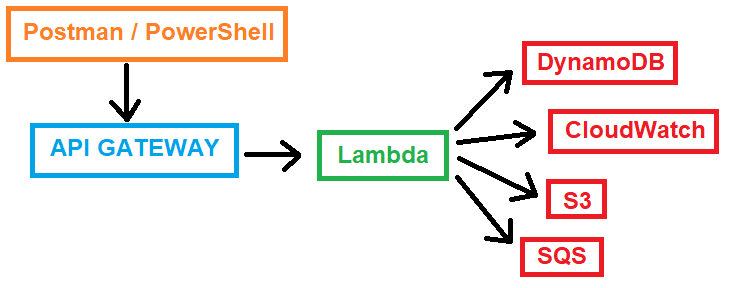
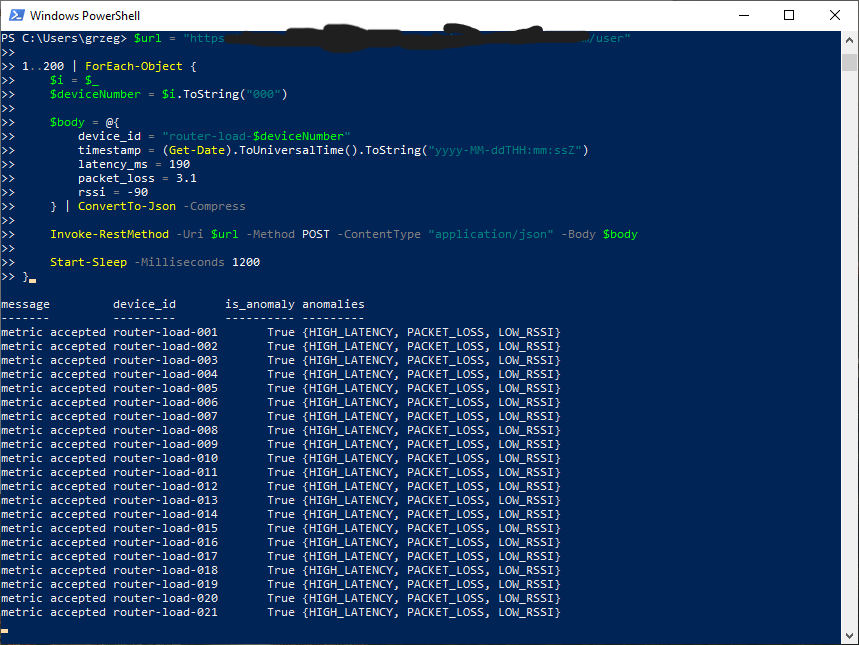
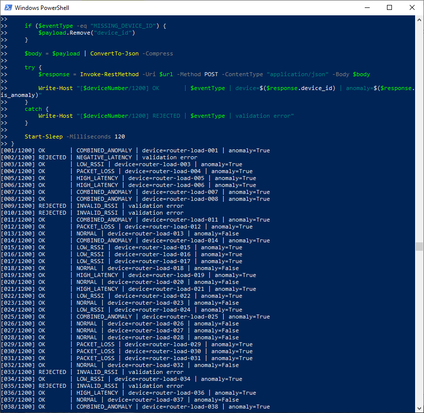
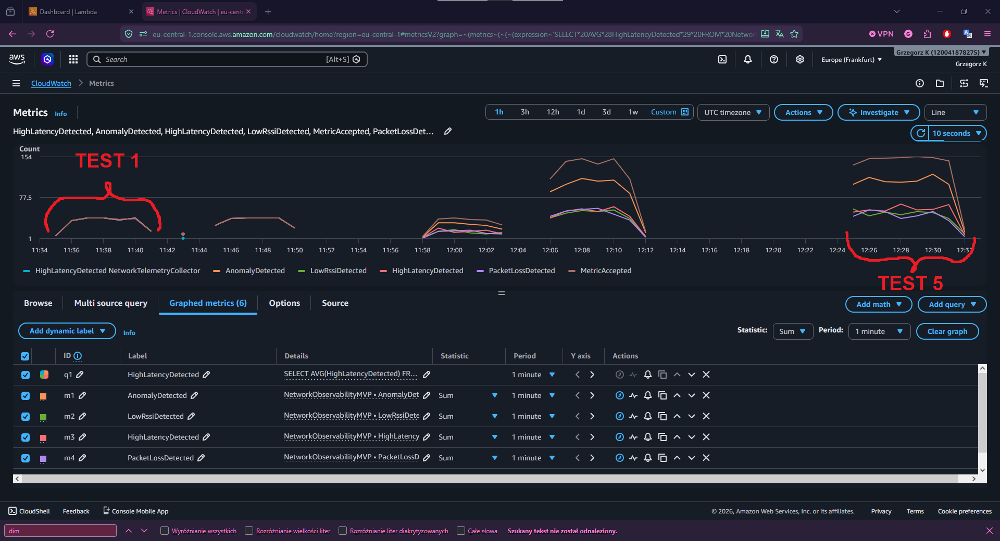

# AWS Serverless Network Observability MVP

Small AWS serverless Python project for collecting network device telemetry, validating metrics and detecting simple connectivity anomalies.

The project is inspired by network observability systems used for device telemetry, metrics collection and troubleshooting.

## Architecture

The project follows a simple serverless telemetry ingestion flow.
Postman or a PowerShell script sends JSON telemetry events to API Gateway. API Gateway triggers the Lambda function, which validates the payload, detects anomalies and sends data to AWS services.

<p align="center">
  
</p>

Current and planned building blocks:

* **API Gateway** receives HTTP telemetry requests.
* **AWS Lambda** processes JSON events, validates metrics and detects anomalies.
* **DynamoDB** stores structured network observations.
* **CloudWatch** stores logs and custom observability metrics.
* **S3** is planned for raw telemetry event archiving.
* **SQS** is planned for asynchronous anomaly event processing.

## AWS services used

* AWS Lambda
* API Gateway
* DynamoDB
* IAM execution role
* CloudWatch Logs
* CloudWatch custom metrics

## Metrics

The Lambda function processes JSON telemetry events with:

* `device_id`
* `timestamp`
* `latency_ms`
* `packet_loss`
* `rssi`

## Anomaly detection rules

* `latency_ms > 150` → `HIGH_LATENCY`
* `packet_loss > 2.0` → `PACKET_LOSS`
* `rssi < -85` → `LOW_RSSI`

Invalid telemetry values are rejected before saving to DynamoDB.

## Example payload

```json
{
  "device_id": "router-001",
  "timestamp": "2026-06-29T22:25:00Z",
  "latency_ms": 190,
  "packet_loss": 3.1,
  "rssi": -90
}
```

## Screenshots

### Successful metric ingestion

<p align="center">
  
</p>

### Anomaly detection

<p align="center">
  
</p>

### Validation error

<p align="center">
  
</p>

### DynamoDB stored observations

<p align="center">
  
</p>

## Randomized telemetry load test

As another small building block of this project, I added a randomized telemetry load-style test.

The test sends multiple JSON events to the API Gateway endpoint using PowerShell. Each event represents a network device telemetry sample with values such as latency, packet loss and RSSI. The script mixes normal metrics, anomaly scenarios and invalid payloads to check how the system behaves with different kinds of input.

The goal was to make the project closer to a real network observability ingestion pipeline, not just a single manually tested Lambda function.

The test verifies the full flow:

* API Gateway receives telemetry events
* AWS Lambda validates the payload
* anomaly detection classifies problematic metrics
* valid observations are stored in DynamoDB
* invalid telemetry is rejected before persistence
* CloudWatch custom metrics show accepted, rejected and anomalous events

Tested scenarios include:

* normal telemetry events
* high latency events
* packet loss events
* low RSSI events
* combined anomaly events
* invalid RSSI values
* negative latency values
* missing required fields

PowerShell randomized load test

<<<<<<< HEAD
<table>
  <tr>
    <td width="50%">
      
    </td>
    <td width="50%">
      
    </td>
  </tr>
</table>
=======
<table> <tr> <td width="50%">  </td> <td width="50%">  </td> </tr> </table>
>>>>>>> e4b1fb5785f2864d9383b34d06620173b1548188

### CloudWatch custom metrics after the test

<p align="center">
  
</p>

### DynamoDB stored telemetry observations

<p align="center">
  
</p>

### Validation error example from Postman

<p align="center">
  
</p>

### Test complexity note

This is a simple randomized PowerShell-based telemetry test, not a full performance benchmark.

Its purpose is to verify different input scenarios: normal metrics, anomaly metrics and invalid payloads.

The test helps confirm that the API Gateway → Lambda → DynamoDB flow works correctly, invalid telemetry is rejected, anomalies are detected and CloudWatch custom metrics are published.


## Tests

```bash
pytest -v
```

Current test coverage includes:

* payload validation
* invalid RSSI rejection
* missing field rejection
* anomaly detection
* Lambda-style handler response

## Next building blocks

This project is built step by step, like adding small engineering blocks to a working system.

Current working blocks:

* API Gateway as the HTTP entry point
* AWS Lambda for Python-based telemetry processing
* DynamoDB for storing validated network observations
* CloudWatch custom metrics for basic observability
* pytest tests for validation and anomaly detection logic
* randomized PowerShell telemetry test

Planned next blocks:

* **S3 raw telemetry archive**
  Store original incoming JSON events in S3 for later troubleshooting and batch analysis.

* **SQS anomaly queue**
  Send detected anomaly events to SQS to simulate asynchronous network troubleshooting workflows.

These additions are planned as small incremental improvements, not as a rewrite of the project.
