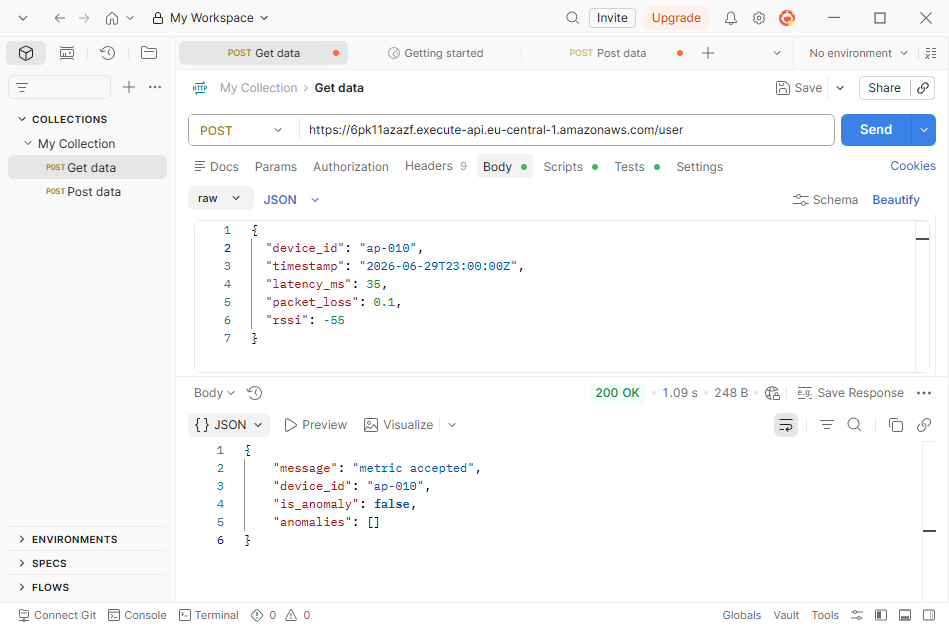
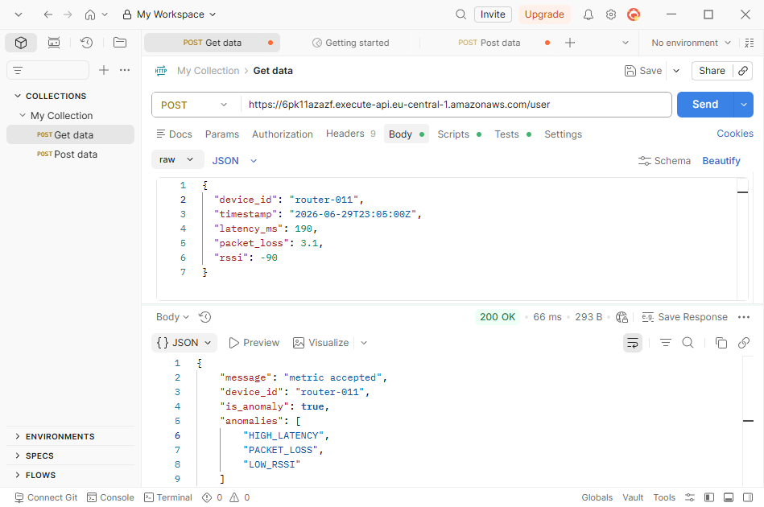
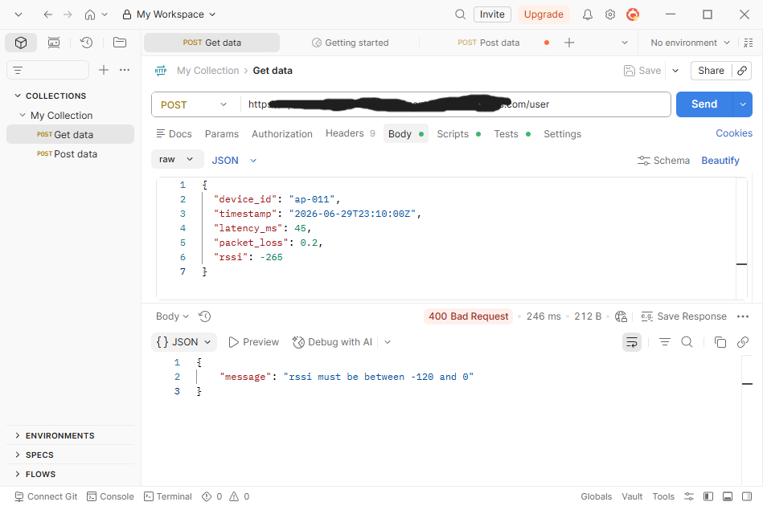
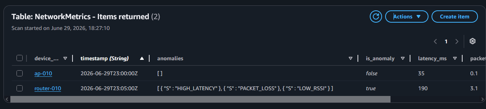

# AWS Serverless Network Observability MVP

Small AWS serverless Python project for collecting network device telemetry, validating metrics and detecting simple connectivity anomalies.

The project is inspired by network observability systems used for device telemetry, metrics collection and troubleshooting.

## Architecture

Postman / HTTP Client  
→ API Gateway  
→ AWS Lambda  
→ validation + anomaly detection  
→ DynamoDB `NetworkMetrics`

## AWS services used

- AWS Lambda
- API Gateway
- DynamoDB
- IAM execution role
- CloudWatch Logs

## Metrics

The Lambda function processes JSON telemetry events with:

- `device_id`
- `timestamp`
- `latency_ms`
- `packet_loss`
- `rssi`

## Anomaly detection rules

- `latency_ms > 150` → `HIGH_LATENCY`
- `packet_loss > 2.0` → `PACKET_LOSS`
- `rssi < -85` → `LOW_RSSI`

Invalid telemetry values are rejected before saving to DynamoDB.

## Example payload

```json
{
  "device_id": "router-001",
  "timestamp": "2026-06-29T22:25:00Z",
  "latency_ms": 190,
  "packet_loss": 3.1,
  "rssi": -90
}

## Screenshots

### Successful metric ingestion


### Anomaly detection


### Validation error


### DynamoDB stored observations
